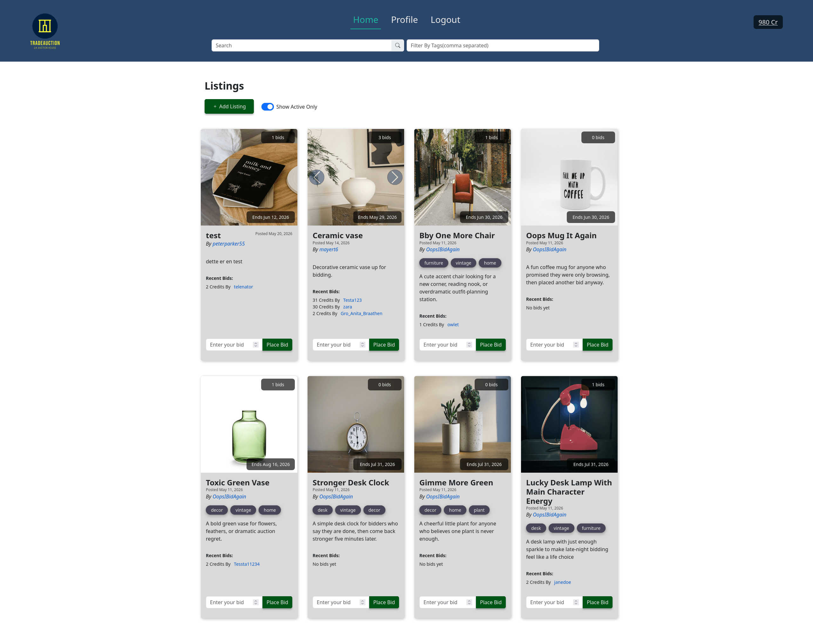

# TradeAuction (Semester Project 2)



## Description

TradeAuction is a modern auction platform where users can list items for bidding and place bids on items from other users. New users receive 1000 credits to get started. The site is built as a front-end application using the Noroff Auction API.

## Built With

- [Vite](https://vitejs.dev/)
- [Bootstrap 5](https://getbootstrap.com)
- [SCSS](https://sass-lang.com/)
- [Vitest](https://vitest.dev/)
- [Playwright](https://playwright.dev/)
- [ESLint](https://eslint.org/)

## Table of Contents

- [Overview](#overview)
- [Getting Started](#getting-started)
  - [Installing](#installing)
  - [Running](#running)
- [UI Components](#ui-components)
- [Features](#features)
- [Development Process Management](#development-process-management)
- [Additional Setup](#additional-setup)
- [Building for Production](#building-for-production)
- [Running Tests](#running-tests)
- [Generating Documentation](#generating-documentation)
- [Contributing](#contributing)
- [Project Resources](#project-resources)

## Overview

TradeAuction allows users to:

- Register with a `stud.noroff.no` email and receive 1000 credits
- Log in, log out, and update their profile
- View their total credits
- Create listings with title, deadline, media gallery, and description
- Bid on other users’ listings
- View bids on listings
- Search and browse listings (available to all users)

## Getting Started

### Installing

To get started with TradeAuction, clone the repository and install dependencies:

```bash
git clone https://github.com/Padletut/semester-project-2
cd semester-project-2
npm install
```

### Environment Variables

This project uses environment variables for configuration.  
A template is provided at `src/.env.example`.

**To set up your environment:**

1. Copy the example file:
   ```bash
   cp src/.env.example src/.env
   ```
2. Open src/.env and fill in your actual values (such as your API key).

### Running

To start the development server:

```bash
npm run dev
```

This will run the SASS watcher and Vite dev server for live development.

## UI Components

### Authentication

- **Registration/Login Form**: stud.noroff.no email required
- **Profile Update**: Update avatar, banner, and bio after logging in
- **Credits Display**: View available credits

### Listings

- **Listing Cards**: Title, images, description, tags, deadline, and bid info
- **Create/Edit Listing Modal**: Add or update listings with media and tags
- **Search/Filter Bar**: Search by title or filter by tags

### Bidding

- **Place Bid Form**: Enter bid amount on listing detail page
- **Bid History**: View all bids for a listing

### Profile

- **User Listings**: View and manage your own listings
- **My Bids**: View all bids placed by the user
- **Bids Won**: See items won by the user

## Features

- **Account Management**: Register, login, logout, update profile, view credits
- **Listing Management**: Create, update, delete, and search auction listings
- **Bidding**: Place bids, view bid history, see bids won
- **Credits System**: Earn credits by selling, spend credits by bidding
- **Responsive UI**: Built with Bootstrap 5 and SCSS

## Additional Setup

### Install Playwright Browsers

After installing dependencies, you need to install the Playwright browsers required for E2E testing:

```bash
npx playwright install
```

### Initialize Husky (Git Hooks)

To enable pre-commit hooks for linting and formatting, initialize Husky:

```bash
npm run prepare
```

## Building for Production

To build the project for production (including CSS autoprefixing):

```bash
npm run build
```

This will output the production-ready files to the `dist/` folder.

---

## Running Tests

### Unit Tests

To run all unit tests with Vitest:

```bash
npm run test
```

### End-to-End (E2E) Tests

To run all Playwright E2E tests in headless mode:

```bash
npm run e2e
```

To run E2E tests with the Playwright UI (for debugging and visual feedback):

```bash
npm run e2e:ui
```

To run E2E tests in headed (non-headless) mode:

```bash
npm run e2e:headed
```

To run E2E tests in debug mode:

```bash
npm run e2e:debug
```

To view the Playwright test report:

```bash
npm run e2e:report
```

### Generating Documentation

To generate the JSDocs for the project, run:

```bash
npm run docs
```

This will generate the JSDoc documentation.

## Contributing

Contributions are welcome! If you'd like to contribute to TradeAuction, please follow these steps:

1. Fork the repository
2. Create a new branch for your feature or fix (`git checkout -b feature/your-feature-name`)
3. Commit your changes with clear, descriptive messages
4. Push your branch and open a pull request for review

Please make sure your code passes all existing tests and linting checks before submitting a pull request.

## Project Resources

- [Design Prototype Mobile](https://www.figma.com/proto/8TNxWMDc1JZCCrtb3MCQS4/Auction-House?node-id=16-57&p=f&t=SOZcYFQohpseY8Dw-1&scaling=scale-down&content-scaling=fixed&page-id=6%3A1769&starting-point-node-id=16%3A57)
- [Design Prototype Large](https://www.figma.com/proto/8TNxWMDc1JZCCrtb3MCQS4/Auction-House?node-id=46-2586&p=f&t=oAaeZ3upR4svNX2Y-1&scaling=min-zoom&content-scaling=fixed&page-id=46%3A2567&starting-point-node-id=46%3A2586)
- [Style Guide](https://www.figma.com/design/8TNxWMDc1JZCCrtb3MCQS4/Auction-House?node-id=0-1&t=w2oaI1mHL3VmLVQz-1)
- [Kanban Board](https://trello.com/b/aSDIvdLu/js2)
- [Live Demo](https://tradeauction.netlify.app/)
